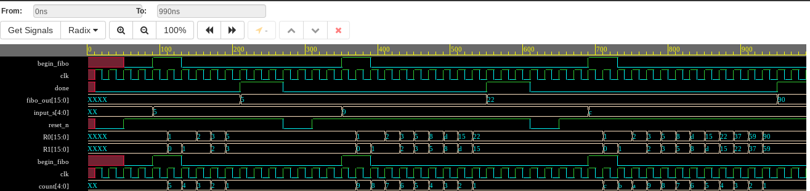

# fibonacci calculator optimization
Implementing the fibonacci calculator using 3 different approaches and analyzing the difference in number of logic devices used. The calculator has a negative edge asynchronous 
reset, takes the value of the number of the term in the fibonacci series that needs to be calculated and initialization signal as its input and returns signals done and the 
output generated.

# Drawing a Comparative
The basic idea behind this project was to firstly create a fibonacci calculator using the FSM Design with 3 different states namely IDLE, COMPUTE and DONE and then later 
optimizing the overall design, the number of logic devices and Lookup tables used and area numbers by using a reducing the number of active states in the FSM and then later 
by by creating a general function for its computation as an array.

# The Generic Approach (fibonacci3)
The initial generic approach includes the use of only a single always_ff block for the entire description of the module. The output signals were also generated inside the 
always block, THUS **LEADING TO THE CREATION OF EXTRA FLIP FLOPS** as expected. Alongside that, 3 states were used in the FSM model.
* You can find its [RTL Design](./fibo3.pdf) here.
* [Synthesis Report map.rpt file](./fibonacci3/output_files/fibonacci.map.rpt)

# Optimized Approach (fibonacci2)
To optimize the design, the output generation block of signals were removed from the always_ff block and were created as separate assign statements as a combinational circuit 
thus avoiding the creation of the unnecessary D-Flip Flops. Also the redundand DONE state was removed from the fsm model.
* You can find its [RTL Design](./fibo2.pdf) here.
* [Synthesis Report map.rpt file](./fibonacci2/output_files/fibonacci2.map.rpt)

# Function based Approach (fibonacci1)
The final Approach removed the concept of FSM based design completely and instead used an array of registers to compute the fibonacci successively in a function block.
* You can find its [RTL Design](./fibo1.pdf) here.
* [Synthesis Report map.rpt file](./fibonacci1/output_files/fibo1.map.rpt)

# Results
All the above designs were synthesised using Quartus and synthesis report was generated which shows the following results:

* **29.5% less Logic Units** were used on adoption of optimizing techniques by moving from generic approach.
* **40.98% less Logic Units** were used on adoption of function based approach.

[Testbench](./fibo_tb.sv) used can be found here.

# Waveforms

